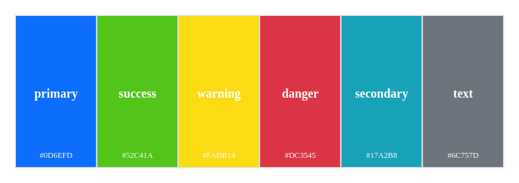
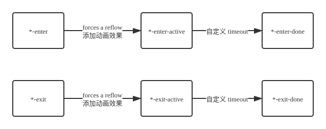

# Boo UI React组件库

> 作者: Bruski aka Boo
>
> 更新时间: 2020/10/18

##  项目初步分析

需要思考的问题

- 代码结构
- 需求分析和编码
- 样式解决方案
- 组件测试用例分析和编码
- 代码打包输出和发布
- CI/CD，文档生成

化繁为简，从简单入手，在需求中慢慢复杂

### 项目结构设计

```
boo-ui-react/
	README.md
	node_modules/
	package.json
	tsconfig.json
	src/
		components/
			Button/
				button.tsx
				button.test.tsx
				style.scss
        styles/
            ...
       	index.tsx
```

### 代码规范

create-react-app 集成了 `react-app`

 vs code 配置 `.vscode/setting.json`

```json
{
  "eslint.validate": {
    "javascript",
    "javascriptreact",
    {"language": "typescript", "autoFix": true}, 
    {"language": "typescriptreact", "autoFix": true}, 
  }
}
```

### 样式解决方案分析

- inline-css 

- css in js
- styled component
- sass / less (Picked!)

文件结构

```
styles/
	_variables.scss  // 变量和可配置项
	_mixins.scss  // 全局 mixins
	_functions.scss  // 全局 functions
components/
	Button/
		style.scss // 组件单独的样式
```

### 创建组件库的色彩体系

系统色板：

	- 基础色板
	- 中性色板

产品色板

- 功能色

色彩体系



### 组件库样式变量分类

- 基础色彩系统
- 字体系统
- 表单
- 按钮
- 边框和阴影
- 可配置开关

### 构建sass全局styles

#### 定义色彩系统

>  `src/styles/_variables.scss`

```scss
/* 系统色板 */
/* ========================== */
/* 中性色 Neutral colors */
$white:   #ffffff   !default;
$black:   #000000   !default;
$gray-100:#f8f9fa   !default;
$gray-200:#e9ecef   !default;
$gray-300:#dee2e6   !default;
$gray-400:#ced4da   !default;
$gray-500:#adb5bd   !default;
$gray-600:#6c757d   !default;
$gray-700:#495057   !default;
$gray-800:#343a40   !default;
$gray-900:#212529   !default;

/* 基础色板 Basic colors */
$red:     #dc3545   !default; // 红
$pink:    #d63384   !default; // 粉
$orange:  #fd7e14   !default; // 橙
$yellow:  #fadb14   !default; // 黄
$green:   #52c41a   !default; // 绿
$teal:    #20c997   !default; // 青
$cyan:    #17a2b8   !default; // 蓝绿
$blue:    #0d6efd   !default; // 蓝
$indigo:  #6610f2   !default; // 靛青
$purple:  #6f42c1   !default; // 紫 

/* 产品色板 */
/* ========================== */
/* 功能色 */
$primary:   $blue       !default;
$secondary: $gray-600   !default;
$success:   $green      !default;
$info:      $cyan       !default;
$warning:   $yellow     !default;
$danger:    $red        !default;
$light:     $gray-100   !default;
$dark:      $gray-800   !default;
```

`!default` 关键字是sass提供，说明该变量可以被覆盖。

### 跨浏览器样式统一

引入 `normalize.css` https://github.com/necolas/normalize.css

在其基础上, 混入预定好的 sass 变量.

#### Sass知识

##### Partial module

`_`开头的文件在sass看来是 partial 模块，只能被导入，不可以单独的编译导出（结果为空）。

使用`@import`不会额外发请求，引入的时候不需要加`_`

例子

```
// 假设同层级有 _variables.scss 文件
@import "variables"
```

## 组件

### Button组件

不同的 Button Type

- Primary
- Default
- Danger
- Link Button

不同的 Button Size

- normal
- small
- large

Disabled状态

- button disable
- link 需要做单独处理

```jsx
<Button
	size="lg"
	type="primary"
	disabled
	href?=""
	className?=""
	autoFocus?=""
	...
>
	prop children
</Button>
```

#### disabled 状态的 css

```scss
&.disabled,
&[disabled] {
    cursor: not-allowed;
    opacity: $btn-disabled-opacity;
    box-shadow: none;
    > * {
        pointer-events: none;
    }
}
```

#### 如何导入button, a 标签 原生属性?

使用 typescript  [Intersection Types 交叉类型](https://www.typescriptlang.org/docs/handbook/unions-and-intersections.html#intersection-types), 即 

```
type NewType = Type1 & Type2
```

将 `React.ButtonHTMLAttributes` 类型与 `自定义props` 结合起来.

又由于 button 和 anchor 存在不同的必选参数, 所以要使用 ts 的 Util type [Partial](https://www.typescriptlang.org/docs/handbook/utility-types.html#partialtype)  将必选变为可选.

结果如下:

```tsx
type NativeButtonProps = BaseButtonProps & React.ButtonHTMLAttributes<HTMLElement>
type AnchorButtonProps = BaseButtonProps & React.AnchorHTMLAttributes<HTMLElement>
type ButtonProps = Partial<NativeButtonProps & AnchorButtonProps>
```

#### 支持用户自定义class

将props的 `className` 透传到 class 即可

#### 支持事件, 其他属性

通过解构 props + 透传 实现.

### Alert组件

用于页面中展示重要的提示信息, 页面中的非浮层元素, 不会自动消失

#### 功能点

- 点击关闭 整个元素消失
- 支持四种主题颜色: success, default, danger, warning
- 可以包含标题和内容,解释更详细的警告
- 右侧是否显示关闭按钮可配置

#### 设计

```
<Alert
	title=""
	content=""
	alertType=""
	closable={true}
	onClose={}
/>
```

### Menu 组件

#### 功能 

- 横向
- 纵向
- 下拉菜单
- disabled

#### 设计

```tsx
<Menu defaultIndex="1" onSelect={} mode="vertical">
	<Menu.Item index="1">
		title one
	</Menu.Item>
	<Menu.Item index="2" disabled>
		diabled link
	</Menu.Item>
	<Menu.SubMenu index="3" title="dropdown">
        <Menu.Item index="3-1">
            sub item
        </Menu.Item>
        <Menu.Item index="3-2">
            sub item
        </Menu.Item>
	</Menu.Item>
</Menu>

interface MenuProps {
    activeIndex: string;
    mode: string;
    onSelect: (selectInedx: number) => void;
    className: string;
}

interface MenuItemProps {
    index: string;
    disabled: boolean;
    className: string;
}
```

#### 传递 selectedIndex 等数据

使用 context 与 useContext Hook 进行透传

#### 限制 children 类型

使用 `React.Children.map` 循环 chilren prop, 对属性名进行过滤

判断 child 是否为 React 组件: `React.FunctionComponentElement`

 子组件也许添加标识,如 `displayName` 让父组件好做判断`

如果不是指定类型,抛出警告,无返回

```tsx
const renderChildren = () => {
  return React.Children.map(children, (child, index) => {
    const childElement = child as React.FunctionComponentElement<MenuItemProps>
    const { displayName } = childElement.type
    if (displayName === 'MenuItem') {
      return child
    } else {
      console.error('Warning: Menu only recognizes children of MenuItem type')
   	  return
    }
  })
}
```

#### 下拉菜单

添加 submenu 组件,

在 Menu 组件的children中增加该类型的支持

水平模式下悬浮弹出子菜单

垂直模式下点击弹出子菜单

##### 下拉菜单动画

使用 react-transition-group 库的 `CSSTransition` 组件实现

```tsx
 <CSSTransition
     in={menuOpen}
     timeout={300}
     classNames="zoom-in-top"
     appear
 >
     <ul className={subMenuClasses}>
     	{childrenComponent}
     </ul>
 </CSSTransition>
```

使用 animate.css 的 zoom-in 效果

```scss
.zoom-in-top {
  &-enter {
    opacity: 0;
    transform: scaleY(0);
  }


  &-enter-active {
    opacity: 1;
    transform: scaleY(1);
    transition: transform 300ms cubic-bezier(0.23, 1, 0.32, 1) 100ms, opacity 300ms cubic-bezier(0.23, 1, 0.32, 1) 100ms;
    transform-origin: center top;
  }

  &-exit {
    opacity: 1;
  }

  &-exit-active {
    opacity: 0;
    transform: scaleY(0);
    transition: transform 300ms cubic-bezier(0.23, 1, 0.32, 1) 100ms, opacity 300ms cubic-bezier(0.23, 1, 0.32, 1) 100ms;
    transform-origin: center top;
  }
}
```

坑点:

1 - display 与 opacity 同时设置,使得 opacity 的动画效果失效: 解决办法见 [opacity 与 display 同时设置, 动画不生效?](#opacity-ani-problem)

2 - 下拉菜单消失时, 无动画效果. 原因: display: none 先生效, 同问题1; 解决办法: 使用 `CSSTransition` 的 `unmountOnExit` 特性, 并移除原来的 css display 控制

### 图标ICON组件

#### 历史

- 上古时代 - 雪碧图(CSS Sprite)
- 近代 - Font icon
- 现代和未来 - SVG

SVG优势

- 完全可控 CSS 属性
- SVG 即取即用, Font icon 要下载全部字体文件
- Font Icon 还有奇怪的 Bug

#### 技术选型

[react-fontawesome](https://github.com/FortAwesome/react-fontawesome): Font Awesome 5 React component using SVG with JS

```
yarn add @fortawesome/fontawesome-svg-core \
         @fortawesome/free-solid-svg-icons \
         @fortawesome/react-fontawesome
```

#### 实现

包裹 fontawesome 组件, 扩展 `theme` 赋予颜色的功能

通过 `theme` 添加 css 类名, 通过 sass 生成对应的 类名与 color 属性值, 即可实现. 

### Transition 动效组件

基于 react-transition-group 的 `CSSTransition` 实现, 扩展了两个字段

- animation: 封装动画class
- wrapper: 给传入组件添加 div 包裹, 避免 css transition 属性与原节点冲突

## 组件测试

### 测试库选型

Jest: https://jestjs.io/ 通用测试工具

[react testing library](https://testing-library.com/docs/react-testing-library/intro): React3.3.0后官方推荐的测试库 npm `@testing-library/react`

[jest-dom](https://github.com/testing-library/jest-dom#usage): 为 jest matcher 新增了对于 DOM 的断言matcher

### 获取当前节点下的一层节点

使用 `:scope` 选择器 https://developer.mozilla.org/en-US/docs/Web/CSS/:scope

配合 `>` 直接子节点, 获取当前节点下的第一层节点

```
ul.querySelectorAll(':scope > li')
```

### 异步断言

`tesing library/react`提供`wait`工具函数,搭配 `await` 使用,将异步断言放进 waitFor 的回调参数中.

```ts
import { fireEvent, wait } from '@testing-library/react'

fireEvent.mouseLeave(dropdownElement)
await wait(() => {
	expect(expect(wrapper.queryByText('drop 1')).not.toBeVisible())
})
```

### 动态添加样式文件

使用 `@testing-library/react` 提供的 matcher `toBeVisible` 可以判断css的 display 样式是否生效

由于 Jest 沙箱不会包含css文件,需要在测试时手动创建

```ts
const createStyleTag = (): HTMLStyleElement => {
  const styleContext = `
    .b-submenu {
      display: none;
    }
    .b-submenu.b-submenu--opened {
      display: block;
    }
  `
  const style = document.createElement('style')
  style.innerHTML = styleContext
  return style
}

wrapper.container.append(createStyleTag())  // 然后在 wrapper 的 container 上加入
```

## 知识点

### 将 css class 名组合起来

`classnames`: https://github.com/JedWatson/classnames

### 批量创建 css 类名

使用 Sass提供的 `@each` 与 `@map` 方法

通过创建 名字与 变量的 map, 再通过 each 循环取出 key, value, 来批量生成类名称与对应变量的值

如批量创建icon颜色类名

```scss
$theme-colors: (
  "primary": $primary,
  "secondary": $secondary,
  "info": $info,
  "warning": $warning,
  "danger": $danger,
  "light": $light,
  "dark": $dark,
);

@each $key, $val in $theme-colors {
  .icon-#{$key} {
    color: $val;
  }
}
```

### CSS动画

### 动画库

`Animate.css`: https://animate.style/

#### 旋转图标

css3 属性 [`transform`](https://developer.mozilla.org/en-US/docs/Web/CSS/transform) rotate

```css
transform: rotate(angleValue)
```

#### <span id="opacity-ani-problem">opacity 与 display 同时设置, 动画不生效?</span>

原因: display 不是一个 animation 支持的属性, 当 display: none -> display: block 变化时, 所有 动画效果都会失效.

解决方案: 通过 js 让 display 先生效, 再让 opacity 变化

思路:

```
// enter
display: none; opacity: 0;
-> display: block; opactiy: 0;
-> display: block; opacity: 1;

// leave
display: block; opacity: 1;
-> display: block; opactiy: 0;
-> display: none; opacity: 0;
```

实现: 使用 `React Transition Group`

`CSSTransitionGroup`原理



## 疑惑

